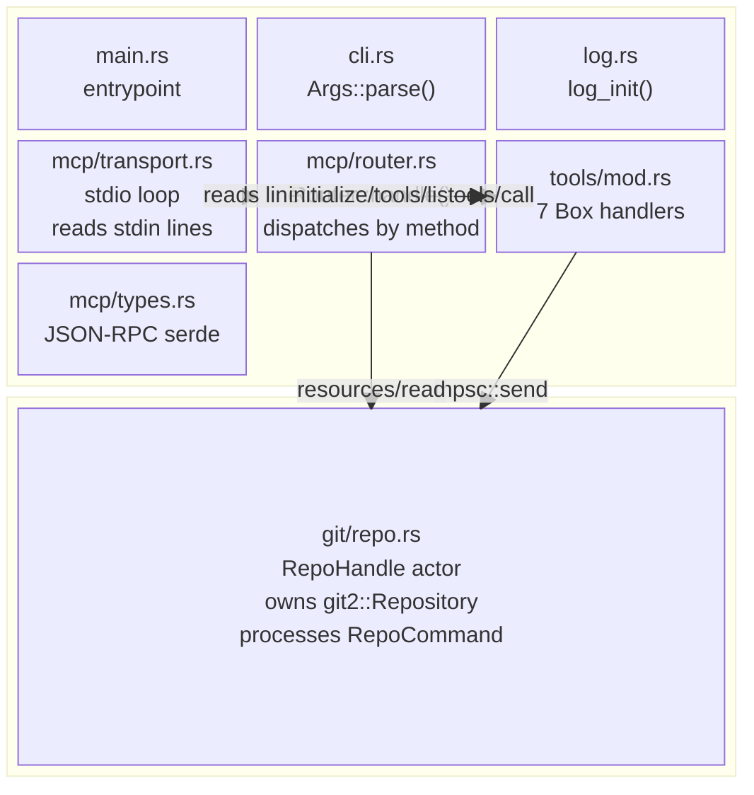
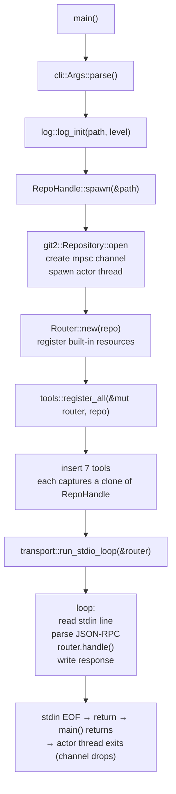
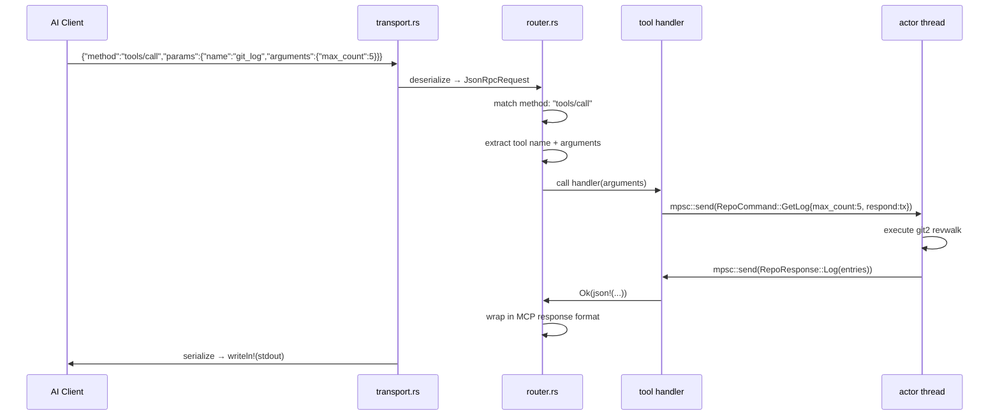
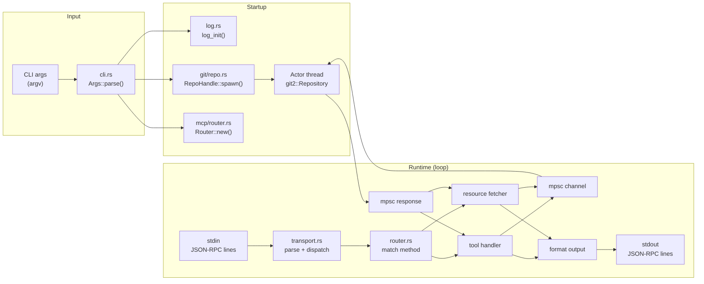
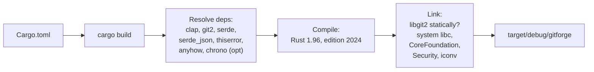
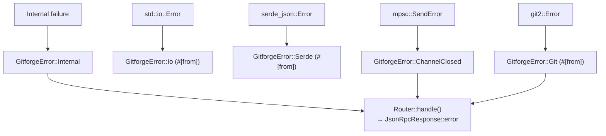

# DEV_IN_DEPTH.md — gitforge internal architecture

Every statement below is traceable to the current HEAD commit.

---

## 1. Project overview

`gitforge` is a single Rust binary crate (edition 2024, v0.1.0) that
implements an **MCP (Model Context Protocol) server** for Git
repositories. It runs over stdin/stdout with line-delimited JSON-RPC 2.0.

**What exists at HEAD:**

- CLI argument parser (`src/cli.rs`) via clap derive
- Thread-safe logger (`src/log.rs`) with feature-gated chrono timestamps
  and source-location output
- `GitforgeError` enum (`src/error.rs`) — 6 variants with `thiserror`
- `RepoHandle` actor (`src/git/repo.rs`) — wraps `git2::Repository` on a
  background thread, 7 command variants via `mpsc` channels
- MCP protocol layer (`src/mcp/`) — JSON-RPC types, Router, stdio
  transport loop
- 7 tool handlers (`src/tools/mod.rs`) — ping, git_status, git_log,
  git_branches, git_diff, git_show, git_commit
- 2 MCP resources (`src/mcp/router.rs`) — `git://HEAD`, `git://status`
- 14 integration tests (`tests/integration.rs`)

**Why the actor pattern:** `git2::Repository` is `!Send` (it holds raw
pointers to libgit2 internals). It cannot be moved between threads or
shared. Wrapping it in an actor that owns the repository on its own
thread and communicates via channels is the standard Rust solution.

---

## 2. Complete architecture



**Ownership:**

| Owner                | Owns                                                   |
| -------------------- | ------------------------------------------------------ |
| `main()`             | `RepoHandle`, `Router`                                 |
| `RepoHandle` (clone) | `mpsc::Sender<RepoCommand>`                            |
| Actor thread         | `mpsc::Receiver<RepoCommand>`, `git2::Repository`      |
| `Router`             | `HashMap<String, Tool>`, `Vec<Resource>`, `RepoHandle` |

---

## 3. Execution flow: startup → shutdown



### Initialisation details

1. **CLI parse** — `clap` parses `std::env::args_os()`. On invalid
   input, clap prints usage and calls `process::exit(2)`.
2. **Logger init** — opens log file (or uses stderr), auto-detects TTY
   for color. See §9 for details.
3. **RepoHandle::spawn** — calls `git2::Repository::open(&path)`. If
   the path is not a valid Git repository, returns
   `GitforgeError::Internal` with the git2 error message. On success,
   spawns a `std::thread` with the receiver end of an `mpsc::channel`.
   Returns `RepoHandle` (the sender) — it is `Clone` so every tool
   handler can own its own sender.
4. **Router init** — `Router::new(repo)` creates an empty tools map,
   registers `git://HEAD` and `git://status` as built-in resources, and
   stores the `RepoHandle` for resource content fetching.
5. **Tool registration** — `tools::register_all` creates 7 tool
   handlers. Each tool that touches Git captures a `RepoHandle::clone()`.
6. **Transport loop** — `run_stdio_loop` locks stdin, iterates lines,
   deserializes JSON-RPC, calls `router.handle()`, and writes the
   response to stdout. This loop is single-threaded and blocking.

### Shutdown

When stdin reaches EOF (the client closes the pipe), the `for line in
stdin.lock().lines()` loop terminates, `run_stdio_loop` returns, and
`main()` returns. The `RepoHandle` (sender) is dropped, the actor
thread's `receiver.recv()` returns `Err(RecvError)`, the actor thread
exits, and `git2::Repository` is dropped (closes all libgit2 handles).

No explicit shutdown handshake. No signal handling.

---

## 4. Control flow: request lifecycle



Notifications follow the same path through `router.handle()` but return
early — `is_notification()` checks for `id: None` or
`method.starts_with("notifications/")` and returns a sentinel response
that `transport.rs` skips writing.

---

## 5. Source tree walkthrough

```
gitforge/
├── Cargo.toml          # binary, 7 deps, 2 feature flags
├── Cargo.lock          # committed
├── LICENSE             # MIT
├── README.md           # user docs
├── DEV.md              # contributor docs
├── DEV_IN_DEPTH.md     # this file
├── AGENTS.md           # AI-agent instructions
├── .rustfmt.toml       # hard_tabs, tab_spaces=4
├── src/
│   ├── main.rs         # entrypoint (~30 lines)
│   ├── cli.rs          # Args struct (~30 lines)
│   ├── error.rs        # GitforgeError enum (~20 lines)
│   ├── log.rs          # logger (~400 lines)
│   ├── git/
│   │   ├── mod.rs      # re-export
│   │   └── repo.rs     # RepoHandle actor (~230 lines)
│   ├── mcp/
│   │   ├── mod.rs      # re-export Router
│   │   ├── types.rs    # JSON-RPC types (~70 lines)
│   │   ├── router.rs   # dispatcher (~300 lines)
│   │   └── transport.rs# stdio loop (~40 lines)
│   └── tools/
│       └── mod.rs      # 7 tool registrations (~270 lines)
└── tests/
    └── integration.rs  # 14 tests (~340 lines)
```

Key design decisions per file:

- **`main.rs`** — Pure orchestration. No business logic. The short
  (~30-line) entrypoint keeps the program's startup sequence readable at
  a glance.
- **`cli.rs`** — Leans fully on clap derive. The `Args` struct is the
  single source of truth for all CLI parameters.
- **`error.rs`** — Use `thiserror` for `From` impls (`git2::Error` and
  `std::io::Error` auto-convert via `#[from]`).
- **`log.rs`** — Ported from a C logger at `dotfiles/global/.../log.c`.
  Uses Cargo features (`show_time_stamp`, `show_source_location`)
  instead of C's `#ifdef`/`-D` flags. The `__function_name!` macro
  recovers the calling function name at compile time via
  `std::any::type_name`.
- **`git/repo.rs`** — The entire module is ~230 lines. The `RepoCommand`
  enum (7 variants) and `RepoResponse` enum (7 variants) define the
  actor's public contract. Each `do_*` method is a pure function on
  `&git2::Repository`.
- **`mcp/router.rs`** — Dual role: method dispatcher AND resource
  registry/content-fetcher. `handle_initialize` returns both `tools`
  and `resources` in a single response (non-standard but pragmatic).
- **`mcp/transport.rs`** — Minimal. Reads lines, delegates to router,
  writes lines. Parse errors return JSON-RPC error `-32700`. Notifications
  are silently dropped.
- **`tools/mod.rs`** — Each `register_*` function captures a
  `RepoHandle` clone in a `Box<dyn Fn + Send>`. The closure opens a
  one-shot channel, sends a command to the actor, waits for the response,
  and formats it.

---

## 6. Module docs

### 6.1 `src/main.rs`

**Responsibility:** Program entrypoint. Orchestrates startup sequence.

**Callers:** None (binary entrypoint).

**Called modules:** `cli`, `log`, `git::RepoHandle`, `mcp::Router`,
`mcp::transport`, `tools`.

**Outgoing calls:** `cli::Args::parse()`, `log::log_init()`,
`git::RepoHandle::spawn()`, `mcp::Router::new()`,
`tools::register_all()`, `mcp::transport::run_stdio_loop()`.

### 6.2 `src/cli.rs`

**Responsibility:** Single source of truth for CLI parameters.

**Exported items:**

- `Args` — `#[derive(Parser)]` struct with 4 fields:
  `repo_path`, `repo`, `log_file`, `log_level`
- `Args::effective_repo_path()` — `--repo` wins over positional

**Field details:**

| Field       | Type              | Clap attr                                     | Default |
| ----------- | ----------------- | --------------------------------------------- | ------- |
| `repo_path` | `PathBuf`         | `#[arg(default_value = ".")]`                 | `.`     |
| `repo`      | `Option<PathBuf>` | `#[arg(long, short)]`                         | `None`  |
| `log_file`  | `Option<PathBuf>` | `#[arg(long)]`                                | `None`  |
| `log_level` | `LogLevel`        | `#[arg(long, short, default_value = "info")]` | `Info`  |

### 6.3 `src/error.rs`

**Responsibility:** Central error type with `thiserror` derive.

**Variants:**

- `Git(git2::Error)` — auto-converted via `#[from]`
- `Io(std::io::Error)` — auto-converted via `#[from]`
- `Serde(serde_json::Error)` — auto-converted via `#[from]`
- `Mcp(String)` — MCP protocol errors
- `Internal(String)` — catch-all internal failures
- `ChannelClosed` — actor channel disconnected

### 6.4 `src/log.rs`

**Responsibility:** Global thread-safe logger, ported from a C original.

Full documentation is in §9 (Logging architecture). Key architectural
decisions:

- **`OnceLock<Mutex<LoggerState>>`** — global singleton, initialized
  on first access with defaults (stderr, Info, no color).
- **Feature gates** — `#[cfg(feature = "show_time_stamp")]` compiles
  chrono-based local-time formatting; `#[cfg(feature =
  "show_source_location")]` compiles `[file:line:func]` output.
- **Macro chain:** `log_info!("msg")` → `log_custom!(Level::Info, true, "msg")`
  → `log_record(level, loc, newline, &format!(...))`.

**Exported macros:**
`log_custom!`, `log_perror!`, `log_fatal!`, `log_error!`, `log_warn!`,
`log_info!`, `log_debug!`, `log_trace!`, `log_level_is_enabled!`.

**Internal helpers:**
`__function_name!`, `__loc!`, `level_label_plain`, `write_color_label`,
`write_time_stamp` (cfg-gated).

### 6.5 `src/git/repo.rs`

**Responsibility:** Actor wrapping `git2::Repository`.

**`RepoCommand` enum (7 variants):**

| Variant        | Fields                                              | Response                                          |
| -------------- | --------------------------------------------------- | ------------------------------------------------- |
| `CheckHealth`  | `respond`                                           | `RepoResponse::Health`                            |
| `GetStatus`    | `respond`                                           | `RepoResponse::Status(Vec<(path, status)>)`       |
| `GetLog`       | `max_count`, `respond`                              | `RepoResponse::Log(Vec<(hash, author, subject)>)` |
| `GetBranches`  | `respond`                                           | `RepoResponse::Branches(Vec<(name, is_head)>)`    |
| `GetDiff`      | `respond`                                           | `RepoResponse::Diff(String)`                      |
| `ShowCommit`   | `revision`, `respond`                               | `RepoResponse::ShowCommit(json!({...}))`          |
| `CreateCommit` | `message`, `author_name`, `author_email`, `respond` | `RepoResponse::CommitCreated(hash)`               |

**`RepoHandle` public API:**

- `spawn(path) -> Result<Self>` — opens repo, spawns thread
- `send(cmd) -> Result<()>` — sends command to actor

**Internal `do_*` methods** (all take `&git2::Repository`):

- `do_status` — `repo.statuses(None)` → filter_map to `(path, Debug status)`
- `do_log` — `repo.revwalk()` → `push_head()` → iterate, bounded by `max_count`
- `do_branches` — `repo.branches(None)` → map to `(name, is_head)`
- `do_diff` — `repo.diff_tree_to_workdir()` → `DiffFormat::Patch` print → String
- `do_show` — `repo.revparse_single(revision)` → peel to commit → `diff_tree_to_tree`
  against parent → structured JSON with hash, author, email, time, message, diff
- `do_commit` — `index.add_all(["*"])` → `write_tree()` → `commit()` with `Signature::now()`

### 6.6 `src/mcp/types.rs`

**Responsibility:** JSON-RPC 2.0 wire format via `serde`.

**Structs:**

- `JsonRpcRequest` — deserializes `jsonrpc`, `id`, `method`, `params`
- `JsonRpcResponse` — serializes `jsonrpc`, `id`, `result`, `error`
  (skip when None)
- `JsonRpcError` — `code`, `message`, `data`

**Helpers:**

- `JsonRpcResponse::success(id, result)` — builder
- `JsonRpcResponse::error(id, code, message)` — builder
- `JsonRpcResponse::notification()` — empty response (all fields None)
- `is_notification(request)` — true if `id` is None or method starts
  with `"notifications/"`

### 6.7 `src/mcp/router.rs`

**Responsibility:** Method dispatcher, tool registry, resource registry
and content fetcher.

**Internal structs:**

- `Tool` — holds `handler: Box<dyn Fn(Value) -> Result<Value, GitforgeError> + Send>`,
  `description`, `input_schema`
- `Resource` — holds `uri`, `name`, `description`, `mime_type`

**Public API:**

- `Router::new(repo)` — registers built-in resources `git://HEAD`,
  `git://status`
- `add_tool(name, description, input_schema, handler)` — inserts into
  tools HashMap
- `handle(JsonRpcRequest) -> JsonRpcResponse` — dispatch entry point

**Method dispatch table:**

| Method            | Handler                 | Returns                                                 |
| ----------------- | ----------------------- | ------------------------------------------------------- |
| `initialize`      | `handle_initialize`     | tools[] + resources[] in result                         |
| `ping`            | inline                  | `{}`                                                    |
| `tools/list`      | `handle_tools_list`     | `{"tools": [...]}`                                      |
| `tools/call`      | `handle_tools_call`     | `{"content": [{"type":"text","text":...}]}`             |
| `resources/list`  | `handle_resources_list` | `{"resources": [...]}`                                  |
| `resources/read`  | `handle_resources_read` | `{"contents": [{"uri":...,"mimeType":...,"text":...}]}` |
| `notifications/*` | inline                  | no response                                             |
| unknown           | inline                  | error -32601                                            |

**Resource content fetching:**

- `git://HEAD` — sends `RepoCommand::ShowCommit{revision: "HEAD"}` to
  actor, formats output as `commit <hash>\nAuthor: ...\nDate: ...\n\n<message>`
  with feature-gated chrono formatting for the date
- `git://status` — sends `RepoCommand::GetStatus` to actor, formats as
  per-file lines or `"nothing to commit, working tree clean"`

### 6.8 `src/mcp/transport.rs`

**Responsibility:** stdin/stdout line-delimited JSON-RPC loop.

**Algorithm:**

```
for line in stdin.lock().lines():
    if line is empty → continue
    try parse as JsonRpcRequest
    on parse error → write JSON-RPC error -32700, continue
    response = router.handle(request)
    if id is None AND result is None AND error is None → skip (notification)
    serialize response → writeln!(stdout) → flush
```

### 6.9 `src/tools/mod.rs`

**Responsibility:** Register all 7 MCP tools on the Router.

Each `register_*` function creates a tool handler closure that:

1. Extracts arguments from the JSON params
2. Creates a one-shot `mpsc::channel`
3. Calls `repo.send(RepoCommand::... { respond: tx })`
4. Blocks on `rx.recv()`
5. Matches on `RepoResponse` variant, formats output

**Tool registration order:** ping, git_status, git_log, git_branches,
git_diff, git_show, git_commit.

The `repo` handle is `clone()`-d for each tool; `git_commit` gets the
last clone.

### 6.10 `tests/integration.rs`

**Responsibility:** End-to-end tests spawning the binary against temp
repos.

**Helper functions:**

- `setup_repo()` — creates `tempfile::TempDir`, runs `git init`, config
  user, creates 2 files with 2 commits
- `send_request(dir, req)` — spawns `CARGO_BIN_EXE_gitforge` with
  `dir.path()` as arg, writes request to stdin, reads one response line

---

## 7. Data flow



---

## 8. Internal APIs

### `RepoHandle`

```rust
impl RepoHandle {
    pub fn spawn(path: &Path) -> Result<Self, GitforgeError>;
    pub fn send(&self, cmd: RepoCommand) -> Result<(), GitforgeError>;
}
```

The one-shot response channel pattern:

```rust
let (tx, rx) = mpsc::channel();
repo.send(RepoCommand::GetStatus { respond: tx })?;
let resp = rx.recv().map_err(|_| GitforgeError::ChannelClosed)??;
```

### `Router`

```rust
impl Router {
    pub fn new(repo: RepoHandle) -> Self;
    pub fn add_tool(&mut self, name: &str, desc: &str,
        input_schema: Value, handler: ToolHandler);
    pub fn handle(&self, request: JsonRpcRequest) -> JsonRpcResponse;
}
```

### `JsonRpcResponse` constructors

```rust
JsonRpcResponse::success(id, result)    // 2.0 + id + result
JsonRpcResponse::error(id, code, msg)   // 2.0 + id + error
JsonRpcResponse::notification()         // 2.0 + all None (skipped by transport)
```

---

## 9. Configuration mechanisms

| Mechanism      | Scope        | Source                                           |
| -------------- | ------------ | ------------------------------------------------ |
| CLI arguments  | Runtime      | `cli::Args` parsed by clap                       |
| Cargo features | Compile time | `show_time_stamp`, `show_source_location`        |
| Logger level   | Runtime      | `log::log_init(path, level)` / `log_set_level()` |
| Logger output  | Runtime      | `log::log_init(path, level)` — file or stderr    |
| Logger color   | Runtime      | auto-detected (TTY), disabled for files          |

---

## 10. Build pipeline



Depends on macOS system frameworks (CoreFoundation, Security, iconv)
via `git2` → `libgit2` — these are resolved at link time by the system
linker.

No LTO or custom profile settings in release mode (Cargo defaults:
codegen-units=16, no LTO).

---

## 11. Runtime model

- **Threads:** 2 at steady state (main thread + actor thread).
- **Async:** None. All I/O is blocking. The stdin read loop runs on the
  main thread; the actor thread processes one command at a time.
- **Memory:** `LoggerState` (~48 bytes) behind `OnceLock<Mutex>` in
  static storage. Each log call allocates a formatted String. The actor
  thread owns `git2::Repository` (heap-heavy — libgit2 internal
  structures). Tool handlers allocate per-request Strings for formatted
  output.
- **Concurrency model:** Sequential command processing on the actor
  thread. The mpsc channel is unbounded — rapid-fire requests queue
  without backpressure.

---

## 12. Error propagation



The `?` operator is used throughout. `Mutex::lock().unwrap()` is the
only `unwrap()` in production paths (lock poisoning is treated as fatal).

---

## 13. Logging architecture

```mermaid
flowchart TD
    A["log_info!(\"msg\")"] --> B["log_custom!(Level::Info, true, \"msg\")"]
    B --> C["__loc!()<br/>→ Some(SourceLoc) or None"]
    C --> D["log_record(level, loc, newline, &formatted_msg)"]
    D --> E["LOGGER.lock().unwrap()"]
    E --> F{"level > state.level?"}
    F -->|yes| G["return (suppressed)"]
    F -->|no| H{"cfg feature<br/>show_time_stamp?"}
    H -->|yes| I["Local::now()<br/>→ [%d-%b-%Y %H:%M:%S%.6f]"]
    H -->|no| J["(skip)"]
    I --> K{"use_color?"}
    J --> K
    K -->|yes| L["write_color_label(stream, level)"]
    K -->|no| M["level_label_plain(level)"]
    L --> N{"cfg feature<br/>show_source_location?"}
    M --> N
    N -->|yes| O["[file:line:func] "]
    N -->|no| P["(skip)"]
    O --> Q["write!(stream, msg)"]
    P --> Q
    Q --> R["writeln! (if newline)"]
    R --> S["stream.flush()"]
```

**Logger state:**

```rust
struct LoggerState {
    stream:    Option<Output>,   // File or Stderr
    level:     LogLevel,         // minimum severity
    use_color: bool,             // ANSI on/off
}
static LOGGER: OnceLock<Mutex<LoggerState>>;
```

**Output enum:** `Output::Stderr` or `Output::File(File)` — both
implement `Write`.

**Timestamps (when `show_time_stamp` is enabled):**
Uses `chrono::Local::now()` for local-time with microsecond precision,
matching the C original's `clock_gettime(CLOCK_REALTIME)` +
`localtime_r()`.

**Source location (when `show_source_location` is enabled):**
Uses `file!()`, `line!()`, and the `__function_name!()` macro (recovers
the calling function via `std::any::type_name`) compiled at the call
site. The full `SourceLoc` struct is captured even though `__func__` is
not a built-in Rust macro.

---

## 14. Memory ownership / object lifetimes

| Object                    | Lifetime               | Owned by                                |
| ------------------------- | ---------------------- | --------------------------------------- |
| `git2::Repository`        | Actor thread duration  | Actor thread local                      |
| `RepoHandle` (Sender)     | Program duration       | Shared via `Clone` among router + tools |
| `LoggerState`             | `'static` (OnceLock)   | Global static                           |
| `Tool` closures           | Router lifetime        | `HashMap` in Router                     |
| `Box<dyn Write>` (logger) | `LoggerState` lifetime | Mutex-guarded inner struct              |

The actor thread owns the repository exclusively. All access goes
through message passing — no shared references to the `Repository`
exist. The `RepoHandle` is a `Clone`-able sender handle; the actual
receiver lives on the actor thread. When the last sender is dropped,
the channel closes and the actor exits.

---

## 15. External dependencies (why each exists)

| Crate                          | Why it exists                                                                                              | Alternatives considered                                                                                                 |
| ------------------------------ | ---------------------------------------------------------------------------------------------------------- | ----------------------------------------------------------------------------------------------------------------------- |
| `clap` 4.6.4                   | CLI arg parsing with derive macros. Gives `--help`, validation, ValueEnum for log levels.                  | Manual `std::env::args()` parsing (rejected: error-prone, no --help).                                                   |
| `git2` 0.21.0                  | libgit2 bindings — only realistic way to manipulate Git repos from Rust without shelling out to `git` CLI. | `gitoxide` (immature at time of choice), `std::process::Command` calling `git` (rejected: fragile, slow, OS-dependent). |
| `serde` 1.0 + `serde_json` 1.0 | JSON-RPC serialization. Derive-driven, zero-cost abstraction.                                              | `json-rust` (less ergonomic), manual string building (rejected: unsafe, error-prone).                                   |
| `thiserror` 2.0                | Zero-boilerplate `Error` derive. Eliminates manual `Display` and `From` impls.                             | `anyhow` for the error enum (rejected: loses `#[from]` auto-conversion).                                                |
| `anyhow` 1.0                   | Error context in fallible paths (minimal use — only `main.rs`).                                            | Used sparingly; `GitforgeError` is the primary error type.                                                              |
| `chrono` 0.4 (optional)        | Local-time timestamps with microsecond precision. Only required when `show_time_stamp` feature is enabled. | `time` crate (different API), manual `libc::localtime_r` (unsafe).                                                      |

---

## 16. Known limitations (observable in HEAD)

1. **No LSP-style logging.** The logger is synchronous and blocks on
   `Mutex::lock()` for every write. At very high log volume this could
   become a bottleneck, but the single-threaded request loop makes this
   unlikely in practice.
2. **No auth or sandboxing.** The server trusts the client completely —
   it reads/writes the Git repository it was pointed at. No access
   control, no path validation beyond what libgit2 enforces.
3. **No streaming responses.** `git_log` with high `max_count` buffers
   all results in memory before writing. Likewise `git_diff` on a large
   tree. The entire response is serialized as a single JSON-RPC message.
4. **No request timeout.** A blocking git2 call (e.g., on a corrupted
   repo) hangs the server forever. No `select!` or timeout wrapper
   around channel receives.
5. **Unbounded channel.** `mpsc::channel` has no backpressure; a fast
   client can queue unlimited commands.
6. **Feature-gated time formatting.** Date display in `git_show` and
   `git://HEAD` changes format depending on whether `show_time_stamp`
   is compiled in — the JSON data is the same, but the human-readable
   text differs.
7. **Logger color auto-detect only.** Color is enabled/disabled at init
   time based on TTY detection. No runtime toggle, no `--color=always`
   flag.
8. **No libgit2 threadsafe init.** `git2` docs recommend calling
   `git2::init()` before any other operation, but the current code
   relies on implicit init via `Repository::open()`. This works on
   macOS but may not on some platforms.
