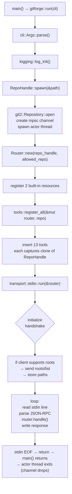
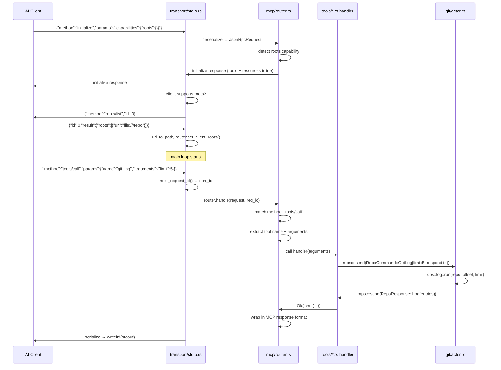
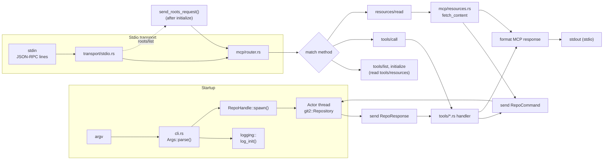
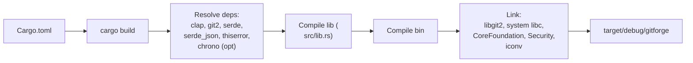
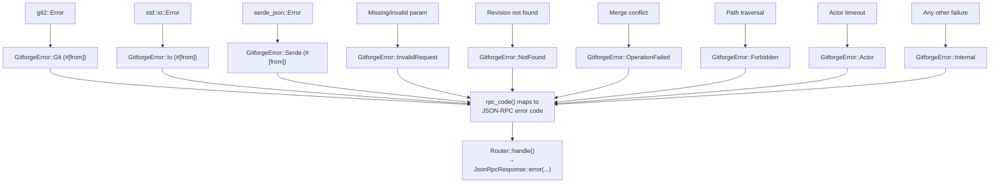

# DEV_IN_DEPTH.md — gitforge internal architecture

Every statement below is traceable to the current HEAD.

---

## 1. Project overview

`gitforge` is a **Rust project** (edition 2024, v0.2.0) with a library
crate (`src/lib.rs`) and a binary crate (`src/main.rs`). It implements
an MCP (Model Context Protocol) server for Git repositories over
line-delimited JSON-RPC 2.0 on stdin/stdout.

**What exists at HEAD (current working tree):**

- CLI argument parser (`src/cli.rs`) via clap derive with `--repo`,
  `--allowed-repo`, `--log-file`, `-l`/`--log-level`, `--log-format`
- Thread-safe logging module (`src/logging/`) with ANSI color, feature-
  gated timestamps + source-location, JSON output format, env-var level
  override, and per-request correlation IDs
- `GitforgeError` enum (`src/error.rs`) — 9 variants with `thiserror`
  and an `rpc_code()` method for mapping to JSON-RPC error codes
- 13 tool handlers (`src/tools/*.rs`) — one file per tool + shared
  helpers in `mod.rs`
- 2 MCP resources (`src/mcp/resources.rs`) — `git://HEAD`, `git://status`
- MCP Roots discovery — optional `roots/list` request after initialize
- Tool annotations — `read_only`, `destructive`, `mutable` hints per tool
- Flag injection defense — `reject_flag` helper rejects values starting
  with `-` in 6 tool handlers
- 18 integration tests (`tests/integration.rs`)

**Line counts (approximate):** 32 source files, ~1800 lines of Rust.

**Why the actor pattern:** `git2::Repository` is `!Send` (raw pointers
to libgit2 internals). Wrapping it in an actor with channel communication
is the standard Rust solution.

**Why library+binary split:** Pure binary meant tests could only spawn
the compiled binary and pipe JSON-RPC over stdio. The library lets tests
import the modules directly.

---

## 2. Complete architecture

```mermaid
block-beta
  columns 4
  block:MainThread["main thread"]
    columns 4
    A["main.rs<br/>sync fn main"]
    B["cli.rs<br/>Args::parse()"]
    C["lib.rs<br/>run()"]
    D["logging::<br/>log_init()"]
    E["transport/stdio.rs<br/>line loop<br/>reads stdin"]
    F["mcp/resources.rs<br/>built-in resources"]
    G["mcp/router.rs<br/>Router::handle()<br/>dispatches by method"]
    H["tools/*.rs<br/>13 handlers"]
    I["mcp/types.rs<br/>JSON-RPC serde"]
    J["git/commands.rs<br/>RepoCommand enum"]
  end
  block:ActorThread["actor thread (git2 only)"]
    columns 1
    M["git/actor.rs<br/>dispatch loop<br/>owns git2::Repository"]
    N["git/ops/*.rs<br/>pure operations<br/>fn(&Repository) -> Result"]
  end
  H -- "mpsc::send" --> J
  J --> M
  M -- "mpsc response" --> H
  E -- "direct call" --> G
  G -- "tools/call" --> H
  G -- "resources/read" --> J
  G -- "initialize/tools/list" --> G
  E -.->|"roots/list (blocking)"| K["MCP Roots<br/>discovery"]
  K --> G
```

After the `initialize` response is sent, if the client declared `roots`
capability, the transport blocks the main loop to send a synchronous
`roots/list` request and store the returned paths before processing
further messages.

**Ownership:**

| Owner                | Owns                                                       |
| -------------------- | ---------------------------------------------------------- |
| `main()` / `run()`   | `RepoHandle`, `Router`, transport loop                     |
| `RepoHandle` (clone) | `mpsc::Sender<RepoCommand>`                                |
| Actor thread         | `mpsc::Receiver<RepoCommand>`, `git2::Repository`          |
| `Router`             | `HashMap<String, Tool>`, `Vec<Resource>`, `RepoHandle`, `allowed_repo`, `client_roots`, `client_supports_roots` |

---

## 3. Execution flow: startup → shutdown



### Initialisation details

1. **CLI parse** — `clap` parses `std::env::args_os()`. The `Cli` struct
   contains `repo_path`, `allowed_repo`, `log_file`, `log_level`, and
   `log_format`. On invalid input, clap prints usage and calls
   `process::exit(2)`.

2. **Logger init** — opens log file (or uses stderr), auto-detects TTY.
   Respects `GITFORGE_LOG_LEVEL` env var (takes precedence over CLI
   flag). Sets log format to `Pretty` (ANSI color) or `Json`.

3. **RepoHandle::spawn** — calls `git2::Repository::open(&path)`. Invalid
   path returns `GitforgeError::Internal(...)`. On success, spawns a
   `std::thread` with the receiver end of an `mpsc::channel`. Returns
   `RepoHandle` (the sender) — it is `Clone` so every tool handler can
   own a sender.

4. **Router init** — `Router::new(repo, allowed_repo)` creates an empty
   tools map, registers `git://HEAD` and `git://status` resources, stores
   the `RepoHandle` for resource content fetching and the optional
   `allowed_repo` path for path validation in `git_add`.

5. **Tool registration** — `tools::register_all` creates 13 tool
   handlers. Each tool captures a `RepoHandle::clone()`.

6. **Transport** — `transport::stdio::run()` starts the stdio read loop.

### Roots discovery (post-initialize)

After sending the `initialize` response, if the client declared the
`roots` capability, the transport sends a `roots/list` JSON-RPC request
and blocks reading the reply. It extracts `file://` URIs from the
response, converts them to local paths via a percent-decoding helper
(`url_to_path`), and stores them on the router via
`router.set_client_roots(paths)`.

This is done synchronously (not in a background task) because:
- It guarantees roots are available before any tool call is dispatched
- The MCP spec allows servers to query roots at any time
- A full async request multiplexer would add complexity for no benefit

### Shutdown

The read loop uses `reader.read_line(&mut line)` rather than
`stdin.lock().lines()` — required because the stdin lock must be shared
with `send_roots_request`. When stdin reaches EOF, `read_line` returns
`Ok(0)`, the loop terminates, `run()` returns, and `main()` returns.
Dropping `RepoHandle` closes the channel; the actor's `receiver.recv()`
returns `Err(RecvError)` and the thread exits.

No explicit shutdown handshake.

---

## 4. Control flow: request lifecycle

### stdio path (with roots discovery)



Notifications follow the same path but `router.handle()` returns a
sentinel response (all fields `None`) that the transport skips writing.

---

## 5. Source tree walkthrough

```
gitforge/
├── Cargo.toml          # lib + bin, 7 deps + 3 dev-deps, 2 features
├── Cargo.lock          # committed
├── LICENSE             # MIT
├── README.md           # user docs
├── DEV.md              # contributor docs
├── DEV_IN_DEPTH.md     # this file
├── AGENTS.md           # AI-agent instructions
├── .rustfmt.toml       # hard_tabs, tab_spaces=4
├── src/
│   ├── lib.rs          # pub fn run(cli)
│   ├── main.rs         # thin ~8-line binary wrapper
│   ├── cli.rs          # Args struct, LogLevel enum, LogFormat enum
│   ├── error.rs        # GitforgeError enum (9 variants) + rpc_code()
│   ├── git/
│   │   ├── mod.rs      # re-export RepoHandle
│   │   ├── actor.rs    # dispatch loop, run_and_respond closure
│   │   ├── commands.rs # RepoCommand enum (13 variants)
│   │   ├── handle.rs   # RepoHandle (sender) + recv_response timeout
│   │   └── ops/
│   │       ├── mod.rs  # re-export each op function
│   │       ├── status.rs
│   │       ├── log.rs
│   │       ├── branches.rs
│   │       ├── diff_unstaged.rs
│   │       ├── diff_staged.rs
│   │       ├── diff_target.rs
│   │       ├── show.rs
│   │       ├── commit.rs
│   │       ├── stage.rs
│   │       ├── branch_create.rs
│   │       ├── checkout.rs
│   │       └── merge.rs
│   ├── logging/
│   │   ├── mod.rs      # LoggerState, log_init, log_record, LogLevel/LogFormat enums
│   │   └── macros.rs   # log_info!, log_error!, etc.
│   ├── mcp/
│   │   ├── mod.rs      # re-export Router + ToolAnnotations
│   │   ├── types.rs    # JSON-RPC 2.0 types (serde)
│   │   ├── router.rs   # method dispatcher, tools HashMap, resource fetching, roots
│   │   └── resources.rs# Resource struct + builtin_resources() + fetch_content()
│   ├── tools/
│   │   ├── mod.rs      # register_all(), call_actor(), required_str(), reject_flag(), unexpected()
│   │   ├── ping.rs
│   │   ├── git_status.rs
│   │   ├── git_log.rs
│   │   ├── git_branches.rs
│   │   ├── git_diff.rs
│   │   ├── git_diff_unstaged.rs
│   │   ├── git_diff_staged.rs
│   │   ├── git_show.rs
│   │   ├── git_commit.rs
│   │   ├── git_add.rs
│   │   ├── git_branch_create.rs
│   │   ├── git_checkout.rs
│   │   └── git_merge.rs
│   ├── transport/
│   │   ├── mod.rs      # re-export stdio
│   │   └── stdio.rs    # run_loop: line-delimited JSON-RPC + roots discovery
└── tests/
    └── integration.rs  # 18 tests with TestSession helper
```

Key design decisions per file:

- **`src/lib.rs`** — `pub fn run(cli: Cli)` is the single entry point.
  Initializes the logger, opens the repo, builds the router, registers
  tools, then starts the stdio transport loop. Keeping this in
  `lib.rs` lets tests import the modules directly, and lets the binary
  be a trivial wrapper.
- **`src/main.rs`** — Exactly 7 lines: `fn main() -> Result<..., Box<dyn Error>> { let cli = Cli::parse(); gitforge::run(cli) }`.
- **`src/cli.rs`** — Uses clap derive with `#[command(name = "gitforge", about = "Git MCP server")]`.
  `GITFORGE_LOG_LEVEL` env var is read at logger init time, not by clap.
  `GITFORGE_REPO` and `GITFORGE_ALLOWED_REPO` are read by clap via
  `#[arg(env = "...")]`.
- **`src/git/commands.rs`** — `RepoCommand` and `RepoResponse` enums
  define the actor's wire protocol. Every command includes a
  `respond: mpsc::Sender<Result<RepoResponse, GitforgeError>>` field.
  This gives each request a dedicated channel back, avoiding head-of-
  line blocking. 13 variants total.
- **`src/git/handle.rs`** — `recv_response(rx)` wraps the blocking
  `rx.recv()` with a 30-second timeout (via
  `std::sync::mpsc::Receiver::recv_timeout`). If the actor is hung, the
  tool returns `GitforgeError::Actor(...)` instead of hanging the
  transport loop.
- **`src/git/actor.rs`** — The actor loop matches on each
  `RepoCommand` variant, calls the corresponding function in
  `git/ops/*.rs`, packages the result into a `RepoResponse`, and sends
  it back through the one-shot channel. Lifecycle logging is handled by
  `run_and_respond`, which logs "received → processing → completed" for
  every command. `RepoHandle` is used by tools to send commands to the
  actor.
- **`src/git/ops/*.rs`** — Pure functions `fn(git2::Repository, args) -> Result<...>`.
  No channel logic, no MCP formatting. Each file is ~15-60 lines.
  The old `diff.rs` was split into `diff_unstaged.rs` (index vs workdir),
  `diff_staged.rs` (HEAD vs index), and `diff_target.rs` (any ref vs HEAD
  via `diff_tree_to_tree`).
- **`src/mcp/router.rs`** — Now stores `allowed_repo` (for path
  validation), `client_roots` (from roots discovery), and
  `client_supports_roots` (from initialize). Every tool has a
  `ToolAnnotations` struct describing its safety profile. The
  `handle()` method takes `req_id: u64` for correlation logging.
  `resource_list_json()` is reused by both `handle_initialize` and
  `handle_resources_list` to avoid duplicating serialization.
- **`src/mcp/resources.rs`** — Extracted from the router. Holds the
  `Resource` struct (uri, name, description, mime_type) and functions
  `builtin_resources()` and `fetch_content()`.
- **`src/tools/mod.rs`** — Four shared helpers: `call_actor` (sends
  command, awaits response with timeout), `required_str` (extracts
  required string param from JSON), `reject_flag` (rejects values
  starting with `-`), `unexpected` (returns error for unexpected
  response type). Each tool is its own file implementing a `register`
  function. Tools are registered in a fixed order via `register_all`.
- **`src/transport/stdio.rs`** — Each line read gets a correlation ID
  from `next_request_id()`. Passes `req_id` to `router.handle()`.
  After the `initialize` response, if the client supports roots, calls
  `send_roots_request()` which sends a `roots/list` JSON-RPC request
  and blocks reading the reply. Uses a manual `read_line` loop (not
  `stdin.lock().lines()`) so the lock can be shared with
  `send_roots_request`. Write failures are logged and break the loop.
- **`tests/integration.rs`** — Tests spawn the binary using
  `CARGO_BIN_EXE_gitforge` — the `TestSession` struct owns the child
  process handles (fixed a bug where `child.stdin.take()` consumed the
  handle after the first call). `setup_repo()` uses the `git2` API
  instead of shelling out to `git init`. 18 tests total.

---

## 6. Module docs

### 6.1 `src/lib.rs`

**Responsibility:** Library entrypoint. Exposes `run(Cli)` for the binary.

**Exported items:**

- `pub fn run(cli: Cli) -> Result<(), Box<dyn std::error::Error>>`
- `pub mod cli`, `pub mod error`, `pub mod git`, `pub mod logging`,
  `pub mod mcp`, `pub mod tools`, `pub mod transport`

**Outgoing calls:** `logging::log_init()`, `RepoHandle::spawn()`,
`mcp::Router::new()`, `tools::register_all()`,
`transport::stdio::run()`.

### 6.2 `src/main.rs`

**Responsibility:** Thinnest possible binary wrapper around lib.

**Content:** ~8 lines — `fn main() -> Result<(), Box<dyn
std::error::Error>> { let cli = Cli::parse(); gitforge::run(cli) }`.

### 6.3 `src/cli.rs`

**Responsibility:** Single source of truth for CLI parameters.

**Exported items:**

- `Cli` — `#[derive(Parser)]` struct:
  - `repo_path: PathBuf` — `#[arg(long = "repo", default_value = ".", env = "GITFORGE_REPO")]`
  - `allowed_repo: Option<PathBuf>` — `#[arg(long, env = "GITFORGE_ALLOWED_REPO")]`
  - `log_file: Option<PathBuf>` — `#[arg(long)]`
  - `log_level: LogLevel` — `#[arg(long, short, default_value = "warn")]`
  - `log_format: LogFormat` — `#[arg(long, default_value = "pretty")]`
- `LogLevel` — `ValueEnum` with `Off`, `Fatal`, `Error`, `Warn`, `Info`,
  `Debug`, `Trace` (with `LogLevel::from_env_str()` for env-var parsing)
- `LogFormat` — `ValueEnum` with `Pretty`, `Json`

`GITFORGE_LOG_LEVEL` env var is read at logger init time (in
`logging/mod.rs`), not by clap. It overrides the CLI `--log-level`
value.

### 6.4 `src/error.rs`

**Responsibility:** Central error type with `thiserror` derive and
JSON-RPC error code mapping.

**Variants:**

- `Git(git2::Error)` — auto-converted via `#[from]`
- `Io(std::io::Error)` — auto-converted via `#[from]`
- `Serde(serde_json::Error)` — auto-converted via `#[from]`
- `InvalidRequest(String)` — malformed params, missing fields
- `NotFound(String)` — revision not found, unknown URI
- `OperationFailed(String)` — git operation failed (merge conflict, etc.)
- `Forbidden(String)` — path traversal or access outside allowed repo
- `Internal(String)` — catch-all
- `Actor(String)` — actor did not respond in time

**`rpc_code()` method:**

| Variant           | JSON-RPC code |
| ----------------- | ------------- |
| `NotFound`        | `-32601`      |
| `InvalidRequest`  | `-32602`      |
| `Forbidden`       | `-32001`      |
| `Serde`           | `-32700`      |
| All other         | `-32000`      |

### 6.5 `src/logging/mod.rs`

**Responsibility:** Global thread-safe logger with JSON support, env
override, and correlation IDs.

**API:**

- `log_init(file_path, level, format)` — initialises the logger
- `log_set_level(level)` — set minimum log level at runtime
- `log_get_level() -> LogLevel` — current minimum level
- `log_use_color() -> bool` — whether ANSI colour is enabled
- `next_request_id() -> u64` — atomic-counter-based correlation ID
- `truncate_for_log(s: &str, max: usize) -> String` — truncates with
  `… (N chars total)` suffix

Other items: `LogLevel` enum (same variants as cli's but with a
`from_env_str()` parser), `LogFormat` enum (`Pretty`, `Json`),
`SourceLoc` struct (used by the `show_source_location` feature).

Default log level is `Warn` (both the CLI default and the fallback in
the `OnceLock` initializer — see `log.rs` doc comment about the
intentional duplication).

### 6.6 `src/logging/macros.rs`

**Responsibility:** Macro expansion for all `log_*!` macros.

Each macro calls `log_record()` with the appropriate `LogLevel`, the
call site location (via `file!()`, `line!()`, `__function_name!()`),
and the formatted message. The `__function_name!()` macro recovers the
calling function name via `std::any::type_name::<T>()` trick.

Macros: `log_perror!`, `log_fatal!`, `log_error!`, `log_warn!`,
`log_info!`, `log_debug!`, `log_trace!`, `log_level_is_enabled!`.

### 6.7 `src/git/commands.rs`

**Responsibility:** Define the actor's wire protocol — `RepoCommand`
and `RepoResponse` enums.

**`RepoCommand` (13 variants):**

| Variant              | Response                        |
| -------------------- | ------------------------------- |
| `CheckHealth`        | `Health`                        |
| `GetStatus`          | `Status(Vec<(path, status)>)`   |
| `GetLog`             | `Log(Vec<(hash, author, subject)>)` |
| `GetBranches`        | `Branches(Vec<(name, is_head)>)`|
| `GetDiffUnstaged`    | `Diff(String)`                  |
| `GetDiffStaged`      | `Diff(String)`                  |
| `GetDiffTarget`      | `Diff(String)`                  |
| `ShowCommit`         | `ShowCommit(Value)`             |
| `CreateCommit`       | `CommitCreated(String)`         |
| `StageFiles`         | `Staged`                        |
| `CreateBranch`       | `BranchCreated(String)`         |
| `Checkout`           | `CheckoutOk`                    |
| `Merge`              | `MergeOk(String)`               |

The old `GetDiff` variant was replaced by three targeted variants:
`GetDiffUnstaged` (workdir vs index), `GetDiffStaged` (index vs HEAD),
and `GetDiffTarget` (any ref tree vs HEAD tree).

### 6.8 `src/git/handle.rs`

**Responsibility:** The public handle to the actor.

**API:**

```rust
impl RepoHandle {
    pub fn spawn(path: &Path) -> Result<Self, GitforgeError>;
    pub fn send(&self, cmd: RepoCommand) -> Result<(), GitforgeError>;
}

pub fn recv_response(
    rx: Receiver<Result<RepoResponse, GitforgeError>>,
) -> Result<RepoResponse, GitforgeError>;
```

`recv_response` wraps `rx.recv_timeout(Duration::from_secs(30))`. If
the actor doesn't respond in 30 seconds, returns
`GitforgeError::Actor("request to repo actor timed out after 30s")`.
This prevents a hung git2 call from blocking the transport loop
indefinitely.

### 6.9 `src/git/actor.rs`

**Responsibility:** The actor dispatch loop that owns `git2::Repository`.

**Algorithm:**

```rust
while let Ok(cmd) = receiver.recv() {
    dispatch(&repo, cmd);
}
```

The `dispatch` function matches each `RepoCommand` variant and calls
the corresponding `ops::*::run` function through `run_and_respond`,
which wraps the call with uniform lifecycle logging ("received →
processing → completed/errored"). Each variant delegates to the
corresponding function in `git/ops/`. The `respond.send()` uses a
one-shot channel; if the receiver has dropped (tool timed out), the
error is silently ignored.

### 6.10 `src/git/ops/*.rs`

**Responsibility:** Pure functions mapping `&git2::Repository` + args to
results. No channel/MCP logic. Each is independently testable in
principle.

- **status.rs** — `repo.statuses(None)` → filter_map `(path, status)`
- **log.rs** — `repo.revwalk()` → `push_head()` → skip by offset via
  `revwalk.nth(offset)` → take by limit
- **branches.rs** — iterates `repo.branches(filter)` with optional
  merge-base ancestry filtering when `contains`/`not_contains` is set
- **diff_unstaged.rs** — `repo.diff_index_to_workdir()` → `DiffFormat::Patch`,
  collects output to `Vec<u8>`, converts via `String::from_utf8`
- **diff_staged.rs** — `repo.diff_tree_to_index(HEAD_tree)` →
  `DiffFormat::Patch`
- **diff_target.rs** — `repo.diff_tree_to_tree(target_tree, HEAD_tree)`
  using `diff_tree_to_tree` rather than `diff_tree_to_workdir` because
  the latter omits files that exist in HEAD but not in the target
- **show.rs** — `repo.revparse_single()` → peel to commit → `diff_tree_to_tree`
  with parent
- **commit.rs** — `index.add_all(["*"])` → `write_tree()` → `commit()`
- **stage.rs** — `index.add_all(patterns)` → `index.write()`
- **branch_create.rs** — `repo.branch(name, &commit, false)`
- **checkout.rs** — `repo.checkout_tree()` → `repo.set_head()` or
  `repo.set_head_detached()`
- **merge.rs** — merge-base detection → fast-forward or three-way merge
  via `repo.merge_trees()`. Does not write the conflicted index on
  conflict (the `index.write()` call was removed to avoid mutating
  on-disk state on failure).

### 6.11 `src/mcp/types.rs`

**Responsibility:** JSON-RPC 2.0 wire format serde.

**Structs:**

- `JsonRpcRequest` — `jsonrpc`, `id` (Number or Null), `method`, `params`
- `JsonRpcResponse` — `jsonrpc`, `id`, `result`, `error` (all `#[serde(skip_serializing_if = "Option::is_none")]`)
- `JsonRpcError` — `code`, `message`, `data`

**Helpers:**

- `JsonRpcResponse::success(id, result)` — builder
- `JsonRpcResponse::error(id, code, message)` — builder
- `JsonRpcResponse::notification()` — all `None` (transport skips writing)
- `JsonRpcResponse::is_notification_sentinel(&self) -> bool` — true if
  id + result + error are all None
- `is_notification(request: &JsonRpcRequest) -> bool` — free function,
  true if id is None or method starts with `"notifications/"`

### 6.12 `src/mcp/router.rs`

**Responsibility:** Method dispatcher + tool registry + MCP Roots
tracking.

**Internal struct `Tool`:**

```rust
struct Tool {
    handler: ToolHandler,         // Box<dyn Fn(Value) -> Result<Value, GitforgeError> + Send + Sync>
    description: String,
    input_schema: Value,
    annotations: ToolAnnotations, // read_only, destructive, mutable hints
}
```

Note: handlers no longer take `req_id` — the correlation ID is captured
in the closure by the transport and threaded through log macros directly.

**`ToolAnnotations` (exported):**

```rust
pub struct ToolAnnotations {
    pub read_only_hint: bool,
    pub destructive_hint: bool,
    pub idempotent_hint: bool,
    pub open_world_hint: bool,
}
```

Pre-built constants:
- `ToolAnnotations::read_only()` — `git_status`, `git_log`, `git_diff*`,
  `git_show`, `git_branches`, `ping`
- `ToolAnnotations::destructive()` — reserved for `git_reset` (not yet
  implemented)
- `ToolAnnotations::mutable()` — `git_add`, `git_commit`,
  `git_branch_create`, `git_checkout`, `git_merge`

**Public API:**

```rust
impl Router {
    pub fn new(repo: RepoHandle, allowed_repo: Option<PathBuf>) -> Self;
    pub fn add_tool(&mut self, name, desc, schema, annotations, handler);
    pub fn handle(&self, request: JsonRpcRequest, req_id: u64) -> JsonRpcResponse;
    pub fn allowed_repo(&self) -> Option<&Path>;
    pub fn client_supports_roots(&self) -> bool;
    pub fn set_client_roots(&self, roots: Vec<String>);
    pub fn client_roots(&self) -> Option<Vec<String>>;
}
```

**Dispatch table:**

| Method            | Handler                 |
| ----------------- | ----------------------- |
| `initialize`      | `handle_initialize`     |
| `ping`            | inline → `{}`           |
| `tools/list`      | `handle_tools_list`     |
| `tools/call`      | `handle_tools_call`     |
| `resources/list`  | `handle_resources_list` |
| `resources/read`  | `handle_resources_read` |
| `notifications/*` | inline → no response    |
| unknown           | inline → error -32601   |

Interior mutability via `Cell<bool>` (for `client_supports_roots`) and
`RefCell<Option<Vec<String>>>` (for `client_roots`) since all access
happens from the single stdio reader thread.

### 6.13 `src/mcp/resources.rs`

**Responsibility:** Resource definitions + content fetching.

**Exported:**

- `Resource` struct — `uri`, `name`, `description`, `mime_type`
- `builtin_resources() -> Vec<Resource>` — returns `git://HEAD` and
  `git://status`
- `fetch_content(repo: &RepoHandle, uri: &str) -> Result<String, GitforgeError>` —
  dispatches by URI, sends appropriate `RepoCommand` to actor, formats
  output

### 6.14 `src/transport/stdio.rs`

**Responsibility:** stdin/stdout line-delimited JSON-RPC loop + MCP
Roots discovery.

**Algorithm:**

```
reader = stdin.lock()
let mut line = String::new()
loop:
    line.clear()
    reader.read_line(&mut line)
    if 0 bytes → break (stdin EOF)
    if line is empty → continue
    corr_id = next_request_id()
    try parse as JsonRpcRequest
    on parse error → write JSON-RPC error -32700
    response = router.handle(request, corr_id)
    if is notification → skip writing
    serialize response → writeln!(stdout) → flush
    if was "initialize" and client supports roots:
        send_roots_request(reader, writer, router, corr_id)
```

**`send_roots_request`** sends a `roots/list` JSON-RPC request with
`id: 0`, reads one line back, extracts `file://` URIs from the
response, converts them to local paths via `url_to_path`, and stores
them via `router.set_client_roots()`.

**`url_to_path`** decodes percent-encoded characters in `file://` URIs
(e.g. `%20` → space). A simple char-by-char decoder.

Write failures break the loop and are logged.

### 6.15 `src/tools/mod.rs`

**Responsibility:** Register all 13 tools + shared helpers.

**Shared helpers:**

- `call_actor(repo, build)` — creates one-shot channel, sends
  `RepoCommand` via `build(tx)`, awaits response via `recv_response`
- `required_str(args, field)` — extracts required string param from
  JSON, returns `InvalidRequest` if missing/wrong type
- `reject_flag(val, field)` — rejects values starting with `-`
  (defense in depth against flag injection)
- `unexpected(op)` — returns `GitforgeError::Internal(...)` for
  unexpected actor response types

**`register_all(router, repo)`** — registers in order: ping,
git_status, git_log, git_branches, git_diff, git_diff_unstaged,
git_diff_staged, git_show, git_commit, git_add, git_branch_create,
git_checkout, git_merge.

### 6.17 `src/tools/*.rs`

**Responsibility:** One file per tool. Each exports a `register`
function that adds the tool handler to the Router.

Each handler pattern:

1. Extract arguments from `args` JSON (using `required_str`,
   `.get().unwrap_or()` for optional params)
2. Call `reject_flag()` on user-supplied string values that could be
   confused with CLI flags
3. Build `RepoCommand` variant with a one-shot `respond` channel
4. Call `call_actor(&repo, |respond| RepoCommand::Variant { ... })`
5. Match response and format output text

The handler signature is:
`fn(args: Value) -> Result<Value, GitforgeError>`.

Six tools apply `reject_flag`: `git_show`, `git_log`,
`git_branch_create`, `git_checkout`, `git_branches`, `git_diff`.
The `git_add` tool applies `path_is_allowed()` (canonicalize + prefix
check) when `allowed_repo` is configured.

### 6.18 `tests/integration.rs`

**Responsibility:** End-to-end tests covering all tools, resources, and
error paths.

**TestSession struct:**

```rust
struct TestSession {
    stdin: BufWriter<ChildStdin>,
    stdout: BufReader<ChildStdout>,
    child: Child,
}
impl Drop for TestSession { fn drop(&mut self) { let _ = self.child.kill(); } }
```

`setup_repo()` uses `git2::Repository::init()` and commits files via
the git2 API. 18 tests total, including three that were added alongside
new tools: `test_git_diff_target`, `test_git_diff_unstaged_and_staged`,
`test_git_branches_filtered`.

---

## 7. Data flow



---

## 8. Internal APIs

### `RepoHandle` + `recv_response`

**`RepoHandle` API:**

```rust
impl RepoHandle {
    pub fn spawn(path: &Path) -> Result<Self, GitforgeError>;
    pub fn send(&self, cmd: RepoCommand) -> Result<(), GitforgeError>;
}
```

**Free function in `handle.rs`:**

```rust
pub fn recv_response(
    rx: Receiver<Result<RepoResponse, GitforgeError>>,
) -> Result<RepoResponse, GitforgeError>;
```

One-shot channel pattern:

```rust
let (tx, rx) = mpsc::channel();
repo.send(RepoCommand::GetStatus { respond: tx })?;
let resp = recv_response(rx)?;  // outer Result from channel, inner from actor
```

### `Router`

```rust
impl Router {
    pub fn new(repo: RepoHandle, allowed_repo: Option<PathBuf>) -> Self;
    pub fn add_tool(&mut self, name: &str, desc: &str,
        input_schema: Value, annotations: ToolAnnotations, handler: ToolHandler);
    pub fn handle(&self, request: JsonRpcRequest, req_id: u64) -> JsonRpcResponse;
    pub fn allowed_repo(&self) -> Option<&Path>;
    pub fn client_supports_roots(&self) -> bool;
    pub fn set_client_roots(&self, roots: Vec<String>);
    pub fn client_roots(&self) -> Option<Vec<String>>;
}
```

### `JsonRpcResponse` constructors

```rust
JsonRpcResponse::success(id, result)    // 2.0 + id + result
JsonRpcResponse::error(id, code, msg)   // 2.0 + id + error
JsonRpcResponse::notification()         // 2.0 + all None (skipped by transport)
```

### `tools/mod.rs` helpers

```rust
pub fn call_actor(
    repo: &RepoHandle,
    build: impl FnOnce(mpsc::Sender<Result<RepoResponse, GitforgeError>>) -> RepoCommand,
) -> Result<RepoResponse, GitforgeError>;
pub fn required_str(args: &Value, key: &str)
    -> Result<String, GitforgeError>;
pub fn reject_flag(val: &str, field: &str)
    -> Result<(), GitforgeError>;
pub fn unexpected(type_name: &str) -> GitforgeError;
```

---

## 9. Configuration mechanisms

| Mechanism          | Scope        | Source                                                |
| ------------------ | ------------ | ----------------------------------------------------- |
| CLI arguments      | Runtime      | `cli::Cli` parsed by clap                             |
| Environment vars   | Runtime      | `GITFORGE_REPO`, `GITFORGE_ALLOWED_REPO`, `GITFORGE_LOG_LEVEL` |
| Cargo features     | Compile time | `show_time_stamp`, `show_source_location`             |
| Logger level       | Runtime      | CLI `-l`/`--log-level` or `GITFORGE_LOG_LEVEL` env   |
| Logger format      | Runtime      | CLI `--log-format pretty|json`                        |
| Logger output      | Runtime      | `--log-file <path>` or stderr                         |
| Logger color       | Runtime      | Auto-detected (TTY), disabled for file output         |

`GITFORGE_LOG_LEVEL` takes precedence over the CLI flag because it's
evaluated at `log_init()` time and overrides any parsed value.
`GITFORGE_REPO` and `GITFORGE_ALLOWED_REPO` are parsed by clap via
`#[arg(env = "...")]`.

---

## 10. Build pipeline



Depends on macOS system frameworks (CoreFoundation, Security, iconv) via
`git2` → `libgit2`. No LTO or custom profile settings.

---

## 11. Runtime model

### Threads

- **Main thread:** Runs the stdio read loop (blocking `stdin.lock()` via
  `read_line`).
- **Actor thread:** Owns `git2::Repository`, processes `RepoCommand`
  variants sequentially.

Total: **2 threads** at steady state.

### Async

No async. All I/O is blocking. The crate has zero async dependencies.

### Concurrency model

- Actor processes commands sequentially on its own thread via `mpsc`.
- `mpsc` channel is unbounded — no backpressure.
- Request timeout of 30 seconds per operation (`RecvTimeoutError::Timeout`
  → `GitforgeError::Actor`).
- No queueing, rate limiting, or request deduplication.

---

## 12. Error propagation



The `?` operator is used throughout. `Mutex::lock().unwrap()` is the
only `unwrap()` in production paths (poison is treated as fatal), aside
from `String::from_utf8(buf).unwrap()` in diff ops where the buffer is
provably valid UTF-8 (built from validated `&str` content).

---

## 13. Logging architecture

```mermaid
flowchart TD
    A["log_info!(\"msg\")"] --> B["logging/macros.rs<br/>capture __loc!()"]
    B --> C["logging/mod.rs<br/>log_record(level, loc, newline, &msg)"]
    C --> D{"WHAT == Pretty?"}
    D -->|yes| E["Format: [LEVEL] file:line:func msg<br/>ANSI color labels<br/>optional chrono timestamp"]
    D -->|no| F["Format: JSON object<br/>{\"ts\":\"...\",\"level\":\"...\",\"msg\":\"...\"}"]
    E --> G["LOGGER.lock().unwrap()"]
    F --> G
    G --> H{"level > state.level?"}
    H -->|yes| I["return (suppressed)"]
    H -->|no| J["write!(stream, formatted)"]
    J --> K["stream.flush()"]
```

### Logger state

```rust
struct LoggerState {
    stream:    Option<Output>,   // File or Stderr
    level:     LogLevel,         // minimum severity
    use_color: bool,             // ANSI on/off
    format:    LogFormat,        // Pretty or Json
}
static LOGGER: OnceLock<Mutex<LoggerState>>;
```

### Correlation IDs

`next_request_id() -> u64` uses an `AtomicU64` counter (incrementing,
starting from 1). Called once per inbound request in the transport loop.
The ID is passed through `router.handle(request, req_id)` and included
in log messages for request tracing.

### JSON format

When `--log-format json` (or `LogFormat::Json`), each log line is a JSON
object with keys: `ts` (ISO 8601), `level` (string), `msg` (string),
`file` (string, if feature enabled), `line` (number, if feature
enabled), `func` (string, if feature enabled). No ANSI codes.

### Truncation

`truncate_for_log(s: &str, max: usize) -> String` truncates long strings
with `… (N chars total)` suffix. Used for diff output in logs to
avoid multi-MB log lines.

---

## 14. Memory ownership / object lifetimes

| Object                    | Lifetime               | Owned by                                |
| ------------------------- | ---------------------- | --------------------------------------- |
| `git2::Repository`        | Actor thread duration  | Actor thread local                      |
| `RepoHandle` (Sender)     | Program duration       | Shared via `Clone` among router + tools |
| `LoggerState`             | `'static` (OnceLock)   | Global static                           |
| `Tool` closures           | Router lifetime        | `HashMap` in Router                     |
| `Router`                  | Program duration       | `main()`                               |
| `Box<dyn Write>` (logger) | `LoggerState` lifetime | Mutex-guarded inner struct              |
| `TestSession`             | Test function duration | Stack (Drop kills child process)        |

The actor thread owns the repository exclusively. No shared references
to `Repository` exist. The `RepoHandle` is a `Clone`-able sender handle;
the actual receiver lives on the actor thread. When the last sender is
dropped, the channel closes and the actor exits.

---

## 15. External dependencies (why each exists)

| Crate                          | Why it exists                                                                                             | Alternatives considered                                                                                               |
| ------------------------------ | --------------------------------------------------------------------------------------------------------- | --------------------------------------------------------------------------------------------------------------------- |
| `clap` 4.6.4                   | CLI arg parsing with derive macros. Gives `--help`, validation, ValueEnum. Features `derive` + `env`.     | Manual `std::env::args()` parsing (error-prone, no --help).                                                           |
| `git2` 0.21.0                  | libgit2 bindings — only realistic way to manipulate Git repos from Rust without shelling out to `git`.    | `gitoxide` (immature at time of choice), `std::process::Command` (fragile, slow, OS-dependent).                      |
| `serde` 1.0 + `serde_json` 1.0 | JSON-RPC serialization. Derive-driven, zero-cost abstraction.                                             | `json-rust` (less ergonomic), manual string building (unsafe).                                                        |
| `thiserror` 2.0                | Zero-boilerplate `Error` derive.                                                                          | `anyhow` for the error enum (loses `#[from]` auto-conversion).                                                        |
| `chrono` 0.4 (optional)        | Local-time timestamps with microsecond precision. Needed for `show_time_stamp` feature.                   | `time` crate (different API), manual `libc::localtime_r` (unsafe).                                                    |
| `tempfile` 3 (dev)             | Temporary repo directories that auto-clean on Drop.                                                       | Manual `tempdir` management (error-prone cleanup).                                                                    |

---

## 16. Known limitations (observable in HEAD)

1. **No auth or sandboxing.** The server trusts the client completely.
   No access control beyond the `--allowed-repo` path check in `git_add`.

2. **No streaming responses.** `git_log` with a large output buffers
   everything in memory. Entire response is a single JSON-RPC message.

3. **Unbounded channel.** `mpsc::channel` has no backpressure. A fast
   client can queue unlimited commands.

4. **Feature-gated time formatting.** Date display in `git_show` and
   `git://HEAD` changes format depending on whether `show_time_stamp` is
   compiled in. JSON data is the same, but text differs.

5. **No libgit2 threadsafe init.** `git2` docs recommend `git2::init()`
   before other operations, but the code relies on implicit init via
   `Repository::open()`. Works on macOS; may not on all platforms.

6. **All parse errors produce generic -32700.** The transport catches
   deserialization errors and returns `-32700` (parse error), but
   cannot differentiate between malformed JSON, missing fields, or
   I/O errors on stdin.

7. **`git_merge` writes conflicted index.** When a three-way merge
   produces conflicts, the on-disk index is not written (the bug was
   fixed). The operation returns an error, leaving the working tree
   unchanged.

8. **`DIM` color constant is unused without features.** The ANSI `DIM`
   code in `logging/mod.rs` is only referenced inside feature-gated
   blocks (`show_time_stamp`, `show_source_location`), so it carries
   an `#[allow(dead_code)]` annotation.
