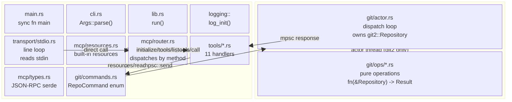
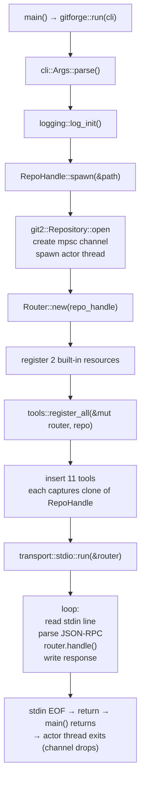
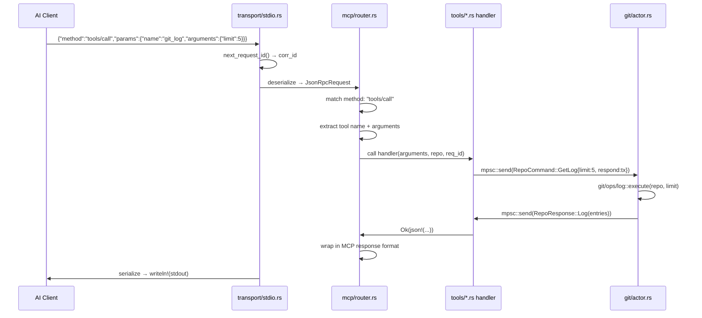
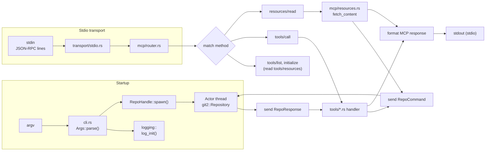
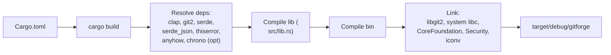
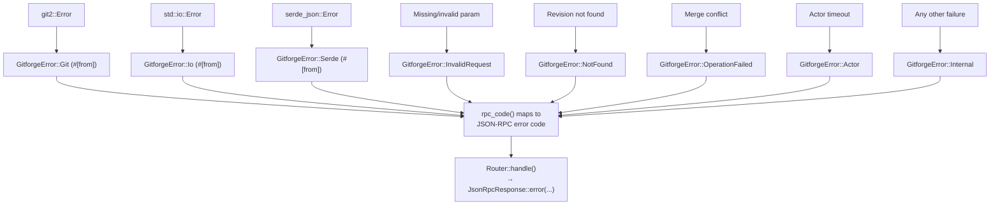

# DEV_IN_DEPTH.md — gitforge internal architecture

Every statement below is traceable to the current HEAD.

---

## 1. Project overview

`gitforge` is a **Rust project** (edition 2024, v0.2.0) with a library
crate (`src/lib.rs`) and a binary crate (`src/main.rs`). It implements
an MCP (Model Context Protocol) server for Git repositories over
line-delimited JSON-RPC 2.0 on stdin/stdout.

**What exists at HEAD (current working tree):**

- CLI argument parser (`src/cli.rs`) via clap derive with `--repo`,
  `--log-file`, `-l`/`--log-level`, `--log-format`
- Thread-safe logging module (`src/logging/`) with ANSI color, feature-
  gated timestamps + source-location, JSON output format, env-var level
  override, and per-request correlation IDs
- `GitforgeError` enum (`src/error.rs`) — 8 variants with `thiserror`
  and an `rpc_code()` method for mapping to JSON-RPC error codes
- 11 tool handlers (`src/tools/*.rs`) — one file per tool + shared
  helpers in `mod.rs`
- 2 MCP resources (`src/mcp/resources.rs`) — `git://HEAD`, `git://status`
- 15 integration tests (`tests/integration.rs`)

**Line counts (approximate):** 33 source files, ~2100 lines of Rust.

**Why the actor pattern:** `git2::Repository` is `!Send` (raw pointers
to libgit2 internals). Wrapping it in an actor with channel communication
is the standard Rust solution.

**Why library+binary split:** Pure binary meant tests could only spawn
the compiled binary and pipe JSON-RPC over stdio. The library lets tests
import the modules directly.

---

## 2. Complete architecture



**Ownership:**

| Owner                | Owns                                                   |
| -------------------- | ------------------------------------------------------ |
| `main()` / `run()`   | `RepoHandle`, `Router`, transport loop                 |
| `RepoHandle` (clone) | `mpsc::Sender<RepoCommand>`                            |
| Actor thread         | `mpsc::Receiver<RepoCommand>`, `git2::Repository`      |
| `Router`             | `HashMap<String, Tool>`, `Vec<Resource>`, `RepoHandle` |

---

## 3. Execution flow: startup → shutdown



### Initialisation details

1. **CLI parse** — `clap` parses `std::env::args_os()`. The `Cli` struct
   contains `repo_path`, `log_file`, `log_level`, and `log_format`. On
   invalid input, clap prints usage and calls `process::exit(2)`.

2. **Logger init** — opens log file (or uses stderr), auto-detects TTY.
   Respects `GITFORGE_LOG_LEVEL` env var (takes precedence over CLI
   flag). Sets log format to `Pretty` (ANSI color) or `Json`.

3. **RepoHandle::spawn** — calls `git2::Repository::open(&path)`. Invalid
   path returns `GitforgeError::Git(...)`. On success, spawns a
   `std::thread` with the receiver end of an `mpsc::channel`. Returns
   `RepoHandle` (the sender) — it is `Clone` so every tool handler can
   own a sender.

4. **Router init** — `Router::new(repo)` creates an empty tools map,
   registers `git://HEAD` and `git://status` resources, stores the
   `RepoHandle` for resource content fetching.

5. **Tool registration** — `tools::register_all` creates 11 tool
   handlers. Each tool captures a `RepoHandle::clone()`.

6. **Transport** — `transport::stdio::run()` starts the stdio read loop.

### Shutdown

When stdin reaches EOF, the `for line in stdin.lock().lines()`
loop terminates, `run()` returns, and `main()` returns. Dropping
`RepoHandle` closes the channel; the actor's `receiver.recv()` returns
`Err(RecvError)` and the thread exits.

No explicit shutdown handshake.

---

## 4. Control flow: request lifecycle

### stdio path



Notifications follow the same path but `router.handle()` returns a
sentinel response (all fields `None`) that the transport skips writing.

---

## 5. Source tree walkthrough

```
gitforge/
├── Cargo.toml          # lib + bin, 9 deps + 3 dev-deps, 2 features
├── Cargo.lock          # committed
├── LICENSE             # MIT
├── README.md           # user docs
├── DEV.md              # contributor docs
├── DEV_IN_DEPTH.md     # this file
├── AGENTS.md           # AI-agent instructions
├── .rustfmt.toml       # hard_tabs, tab_spaces=4
├── src/
│   ├── lib.rs          # pub fn run(cli)
│   ├── main.rs         # thin ~8-line binary wrapper
│   ├── cli.rs          # Args struct, LogLevel enum, LogFormat enum
│   ├── error.rs        # GitforgeError enum (8 variants) + rpc_code()
│   ├── git/
│   │   ├── mod.rs      # re-export RepoHandle
│   │   ├── actor.rs    # dispatch loop, do_* dispatch via send
│   │   ├── commands.rs # RepoCommand enum (11 variants)
│   │   ├── handle.rs   # RepoHandle (sender) + recv_response timeout
│   │   └── ops/
│   │       ├── mod.rs  # re-export each op function
│   │       ├── status.rs
│   │       ├── log.rs
│   │       ├── branches.rs
│   │       ├── diff.rs
│   │       ├── show.rs
│   │       ├── commit.rs
│   │       ├── add.rs
│   │       ├── branch_create.rs
│   │       ├── checkout.rs
│   │       └── merge.rs
│   ├── logging/
│   │   ├── mod.rs      # LoggerState, log_init, log_record, LogLevel enum
│   │   └── macros.rs   # log_info!, log_error!, etc.
│   ├── mcp/
│   │   ├── mod.rs      # re-export Router
│   │   ├── types.rs    # JSON-RPC 2.0 types (serde)
│   │   ├── router.rs   # method dispatcher, tools HashMap, resource fetching
│   │   └── resources.rs# Resource struct + builtin_resources() + fetch_content()
│   ├── tools/
│   │   ├── mod.rs      # register_all(), call_actor(), required_str(), unexpected()
│   │   ├── ping.rs
│   │   ├── git_status.rs
│   │   ├── git_log.rs
│   │   ├── git_branches.rs
│   │   ├── git_diff.rs
│   │   ├── git_show.rs
│   │   ├── git_commit.rs
│   │   ├── git_add.rs
│   │   ├── git_branch_create.rs
│   │   ├── git_checkout.rs
│   │   └── git_merge.rs
│   ├── transport/
│   │   ├── mod.rs      # re-export stdio + http
│   │   ├── stdio.rs    # run_loop: line-delimited JSON-RPC
└── tests/
    └── integration.rs  # 15 tests with TestSession helper
```

Key design decisions per file:

- **`src/lib.rs`** — `pub fn run(cli: Cli)` is the single entry point.
  Initializes the logger, opens the repo, builds the router, registers
  tools, then starts the stdio transport loop. Keeping this in
  `lib.rs` lets tests import the modules directly, and lets the binary
  be a trivial wrapper.
- **`src/main.rs`** — Exactly 8 lines: `fn main() -> Result<..., Box<dyn Error>> { let cli = Cli::parse(); gitforge::run(cli) }`.
- **`src/cli.rs`** — Uses clap derive with `#[command(name = "gitforge", about = "Git MCP server")]`.
  `GITFORGE_LOG_LEVEL` env var is read at logger init time, not by clap.
- **`src/git/commands.rs`** — `RepoCommand` and `RepoResponse` enums
  define the actor's wire protocol. Every command includes a
  `respond: mpsc::Sender<Result<RepoResponse, GitforgeError>>` field.
  This gives each request a dedicated channel back, avoiding head-of-
  line blocking.
- **`src/git/handle.rs`** — `RepoHandle::recv_response(rx)` wraps the
  blocking `rx.recv()` with a 30-second timeout (via
  `std::sync::mpsc::Receiver::recv_timeout`). If the actor is hung, the
  tool returns `GitforgeError::Internal("Actor did not respond in
  time")` instead of hanging the transport loop.
- **`src/git/actor.rs`** — The actor loop matches on each
  `RepoCommand` variant, calls the corresponding function in
  `git/ops/*.rs`, packages the result into a `RepoResponse`, and sends
  it back through the one-shot channel. `RepoHandle` is used by tools
  to send commands to the actor.
- **`src/git/ops/*.rs`** — Pure functions `fn(git2::Repository, args) -> Result<...>`.
  No channel logic, no MCP formatting. Each file is ~20-60 lines.
- **`src/mcp/router.rs`** — `handle()` now takes `req_id: u64` for
  correlation logging. Error handling uses `rpc_code()` to map
  `GitforgeError` variants to JSON-RPC error codes. Extracted
  `tool_list_json()` and `resource_list_json()` helpers for reuse by
  `handle_initialize` and `handle_tools_list`/`handle_resources_list`.
- **`src/mcp/resources.rs`** — Extracted from the router. Holds the
  `Resource` struct (uri, name, description, mime_type) and functions
  `builtin_resources()` and `fetch_content()`.
- **`src/tools/mod.rs`** — Three shared helpers: `call_actor` (sends
  command, awaits response with timeout), `required_str` (extracts
  required string param from JSON), `unexpected` (returns error for
  unexpected response type). Each tool is its own file implementing
  `register_*` or `handle_*` depending on style.
- **`src/transport/stdio.rs`** — Each line read gets a correlation ID
  from `next_request_id()`. Passes `req_id` to `router.handle()`.
  Write failures are logged and break the loop.
- **`tests/integration.rs`** — Tests spawn the binary using
  `CARGO_BIN_EXE_gitforge` — the `TestSession` struct owns the child
  process handles (fixed a bug where `child.stdin.take()` consumed the
  handle after the first call). `setup_repo()` uses the `git2` API
  instead of shelling out to `git init`.

---

## 6. Module docs

### 6.1 `src/lib.rs`

**Responsibility:** Library entrypoint. Exposes `run(Cli)` for the binary.

**Exported items:**

- `pub fn run(cli: Cli) -> Result<(), Box<dyn std::error::Error>>`
- `pub mod cli`, `pub mod error`, `pub mod git`, `pub mod logging`,
  `pub mod mcp`, `pub mod tools`, `pub mod transport`

**Outgoing calls:** `logging::log_init()`, `RepoHandle::spawn()`,
`mcp::Router::new()`, `tools::register_all()`,
`transport::stdio::run()`.

### 6.2 `src/main.rs`

**Responsibility:** Thinnest possible binary wrapper around lib.

**Content:** 8 lines — `fn main() -> Result<(), Box<dyn
std::error::Error>> { let cli = Cli::parse(); gitforge::run(cli) }`.
Stdio mode is fully synchronous.

### 6.3 `src/cli.rs`

**Responsibility:** Single source of truth for CLI parameters.

**Exported items:**

- `Cli` — `#[derive(Parser)]` struct:
  - `repo_path: PathBuf` — `#[arg(long = "repo", default_value = ".")]`
  - `log_file: Option<PathBuf>` — `#[arg(long)]`
  - `log_level: LogLevel` — `#[arg(long, short, default_value = "info")]`
  - `log_format: LogFormat` — `#[arg(long, default_value = "pretty")]`
- `LogLevel` — `ValueEnum` with `Off`, `Fatal`, `Error`, `Warn`, `Info`,
  `Debug`, `Trace`
- `LogFormat` — `ValueEnum` with `Pretty`, `Json`

`GITFORGE_LOG_LEVEL` env var is read at logger init time (in
`logging/mod.rs`), not by clap. It overrides the CLI `--log-level`
value.

### 6.4 `src/error.rs`

**Responsibility:** Central error type with `thiserror` derive and
JSON-RPC error code mapping.

**Variants:**

- `Git(git2::Error)` — auto-converted via `#[from]`
- `Io(std::io::Error)` — auto-converted via `#[from]`
- `Serde(serde_json::Error)` — auto-converted via `#[from]`
- `InvalidRequest(String)` — malformed params, missing fields
- `NotFound(String)` — revision not found, unknown URI
- `OperationFailed(String)` — git operation failed (merge conflict, etc.)
- `Internal(String)` — catch-all
- `Actor(String)` — actor did not respond in time

**`rpc_code()` method:**

| Variant           | JSON-RPC code |
| ----------------- | ------------- |
| `NotFound`        | `-32601`      |
| `InvalidRequest`  | `-32602`      |
| `Serde`           | `-32700`      |
| All other         | `-32000`      |

### 6.5 `src/logging/mod.rs`

**Responsibility:** Global thread-safe logger with JSON support, env
override, and correlation IDs.

Full documentation in §13. Key items:

- `log_init(level_opt: Option<LogLevel>, file: Option<PathBuf>, format: LogFormat)`
- `next_request_id() -> u64` — atomic-counter-based correlation ID
- `truncate_for_log(s: &str, max: usize) -> String` — truncates with
  `...[truncated N bytes]` suffix
- `LogLevel` enum (same variants as cli's but self-contained)
- `LogFormat` enum (`Pretty`, `Json`)

### 6.6 `src/logging/macros.rs`

**Responsibility:** Macro expansion for all `log_*!` macros.

Each macro calls `log_record()` with the appropriate `LogLevel`, the
call site location (via `file!()`, `line!()`, `__function_name!()`),
and the formatted message. The `__function_name!()` macro recovers the
calling function name via `std::any::type_name::<T>()` trick.

Macros: `log_perror!`, `log_fatal!`, `log_error!`, `log_warn!`,
`log_info!`, `log_debug!`, `log_trace!`, `log_level_is_enabled!`.

### 6.7 `src/git/commands.rs`

**Responsibility:** Define the actor's wire protocol — `RepoCommand`
and `RepoResponse` enums.

**`RepoCommand` (11 variants):**

| Variant          | Response                         |
| ---------------- | -------------------------------- |
| `CheckHealth`    | `Health`                         |
| `GetStatus`      | `Status(Vec<(path, status)>)`    |
| `GetLog`         | `Log(Vec<(hash, author, subject)>)` |
| `GetBranches`    | `Branches(Vec<(name, is_head)>)` |
| `GetDiff`        | `Diff(String)`                   |
| `ShowCommit`     | `ShowCommit(Value)`              |
| `CreateCommit`   | `CommitCreated(String)`          |
| `StageFiles`     | `Staged`                         |
| `CreateBranch`   | `BranchCreated(String)`          |
| `Checkout`       | `CheckoutOk`                     |
| `Merge`          | `MergeOk(String)`                |

### 6.8 `src/git/handle.rs`

**Responsibility:** The public handle to the actor.

**API:**

```rust
impl RepoHandle {
    pub fn spawn(path: &Path) -> Result<Self, GitforgeError>;
    pub fn send(&self, cmd: RepoCommand) -> Result<(), GitforgeError>;
    pub fn recv_response<T>(rx: mpsc::Receiver<Result<T, GitforgeError>>)
        -> Result<T, GitforgeError>;
}
```

`recv_response` wraps `rx.recv_timeout(Duration::from_secs(30))`. If
the actor doesn't respond in 30 seconds, returns
`GitforgeError::Actor("Actor did not respond in time")`. This prevents
a hung git2 call from blocking the transport loop indefinitely.

### 6.9 `src/git/actor.rs`

**Responsibility:** The actor dispatch loop that owns `git2::Repository`.

**Algorithm:**

```rust
loop {
    match receiver.recv() {
        Ok(cmd) => match cmd {
            RepoCommand::CheckHealth { respond } =>
                respond.send(Ok(RepoResponse::Health)),
            RepoCommand::GetStatus { respond } =>
                respond.send(ops::status::execute(&repo).map(RepoResponse::Status)),
            // ... one match arm per variant ...
        },
        Err(_) => break, // channel closed
    }
}
```

Each variant delegates to the corresponding function in `git/ops/`.
The `respond.send()` is a `try_send` on a one-shot channel; if the
receiver has dropped (tool timed out), the error is silently ignored.

### 6.10 `src/git/ops/*.rs`

**Responsibility:** Pure functions mapping `&git2::Repository` + args to
results. No channel/MCP logic. Each is independently testable in
principle.

- **status.rs** — `repo.statuses(None)` → filter_map to `(path, status)`
- **log.rs** — `repo.revwalk()` → `push_head()` → skip by offset → take by limit
- **branches.rs** — `repo.branches(None)` → map to `(name, is_head)`
- **diff.rs** — `repo.diff_tree_to_workdir()` → `DiffFormat::Patch`
- **show.rs** — `repo.revparse_single()` → peel to commit → diff with parent
- **commit.rs** — `index.add_all(["*"])` → `write_tree()` → `commit()`
- **add.rs** — `index.add_path(path)` → `write_tree()`
- **branch_create.rs** — `repo.branch(name, &head_commit, false)`
- **checkout.rs** — `repo.set_head(branch_ref)` → `repo.checkout_head(None)`
- **merge.rs** — `repo.find_annotated_commit()` → `repo.merge()` →
  handles fast-forward by resetting head

### 6.11 `src/mcp/types.rs`

**Responsibility:** JSON-RPC 2.0 wire format serde.

**Structs:**

- `JsonRpcRequest` — `jsonrpc`, `id` (Number or Null), `method`, `params`
- `JsonRpcResponse` — `jsonrpc`, `id`, `result`, `error` (all `#[serde(skip_serializing_if = "Option::is_none")]`)
- `JsonRpcError` — `code`, `message`, `data`

**Helpers:**

- `JsonRpcResponse::success(id, result)` — builder
- `JsonRpcResponse::error(id, code, message)` — builder
- `JsonRpcResponse::notification()` — all `None` (transport skips writing)
- `JsonRpcResponse::is_notification_sentinel(&self) -> bool` — true if
  id + result + error are all None
- `is_notification(request: &JsonRpcRequest) -> bool` — free function,
  true if id is None or method starts with `"notifications/"`

### 6.12 `src/mcp/router.rs`

**Responsibility:** Method dispatcher + tool registry.

**Internal struct `Tool`:**

```rust
struct Tool {
    handler: Box<dyn Fn(Value, u64) -> Result<Value, GitforgeError> + Send>,
    description: String,
    input_schema: Value,
}
```

Note: handler takes `req_id: u64` for correlation logging in tools.

**Public API:**

- `Router::new(repo: RepoHandle) -> Self`
- `add_tool(&mut self, name, desc, schema, handler)`
- `handle(&self, request: JsonRpcRequest, req_id: u64) -> JsonRpcResponse`

**Dispatch table:**

| Method            | Handler                 |
| ----------------- | ----------------------- |
| `initialize`      | `handle_initialize`     |
| `ping`            | inline → `{}`           |
| `tools/list`      | `handle_tools_list`     |
| `tools/call`      | `handle_tools_call`     |
| `resources/list`  | `handle_resources_list` |
| `resources/read`  | `handle_resources_read` |
| `notifications/*` | inline → no response    |
| unknown           | inline → error -32601   |

### 6.13 `src/mcp/resources.rs`

**Responsibility:** Resource definitions + content fetching.

**Exported:**

- `Resource` struct — `uri`, `name`, `description`, `mime_type`
- `builtin_resources() -> Vec<Resource>` — returns `git://HEAD` and
  `git://status`
- `fetch_content(uri: &str, repo: &RepoHandle) -> Result<String, GitforgeError>` —
  dispatches by URI, sends appropriate `RepoCommand` to actor, formats output

### 6.14 `src/transport/stdio.rs`

**Responsibility:** stdin/stdout line-delimited JSON-RPC loop.

**Algorithm:**

```
for line in stdin.lock().lines():
    corr_id = next_request_id()
    if line is empty → continue
    try parse as JsonRpcRequest
    on parse error → write JSON-RPC error -32700 with corr_id
    response = router.handle(request, corr_id)
    if is notification → skip writing
    serialize response → writeln!(stdout) → flush
```

Write failures break the loop and are logged.

### 6.15 `src/tools/mod.rs`

**Responsibility:** Register all 11 tools + shared helpers.

**Shared helpers:**

- `call_actor(repo: &RepoHandle, cmd: RepoCommand) -> Result<RepoResponse>` —
  sends command, calls `repo.recv_response(rx)`
- `required_str(args: &Value, key: &str) -> Result<String, GitforgeError>` —
  extracts + validates required string param
- `unexpected(t: &str) -> GitforgeError` — returns
  `GitforgeError::Internal(f"unexpected response type: {t}")`

**`register_all(router, repo)`** — registers in order: ping,
git_status, git_log, git_branches, git_diff, git_show, git_commit,
git_add, git_branch_create, git_checkout, git_merge.

### 6.17 `src/tools/*.rs`

**Responsibility:** One file per tool. Each exports a `register_*`
function that adds the tool handler to the Router.

Each handler pattern:

1. Extract arguments from `params` JSON (using `required_str`, etc.)
2. Build `RepoCommand` variant with a one-shot `respond` channel
3. Call `repo.send(command)`
4. Block on `repo.recv_response(rx)`
5. Match response and format output text

The `handle_*` signature is:
`fn(args: Value, req_id: u64) -> Result<Value, GitforgeError>`.

### 6.18 `tests/integration.rs`

**Responsibility:** End-to-end tests covering all tools, resources, and
error paths across both transports.

**TestSession struct:**

```rust
struct TestSession {
    stdin: BufWriter<ChildStdin>,
    stdout: BufReader<ChildStdout>,
    child: Child,
}
impl Drop for TestSession { fn drop(&mut self) { let _ = self.child.kill(); } }
```

Fixes the bug where `send_requests` consumed `child.stdin.take()` and
`child.stdout.take()`, making it only usable once. `TestSession` holds
owned handles for its entire lifetime.

`setup_repo()` uses `git2::Repository::init()` and commits files via
the git2 API.

---

## 7. Data flow



---

## 8. Internal APIs

### `RepoHandle` + `recv_response`

**`RepoHandle` API:**

```rust
impl RepoHandle {
    pub fn spawn(path: &Path) -> Result<Self, GitforgeError>;
    pub fn send(&self, cmd: RepoCommand) -> Result<(), GitforgeError>;
}
```

**Free function in `handle.rs`:**

```rust
pub fn recv_response(
    rx: Receiver<Result<RepoResponse, GitforgeError>>,
) -> Result<RepoResponse, GitforgeError>;
```

One-shot channel pattern:

```rust
let (tx, rx) = mpsc::channel();
repo.send(RepoCommand::GetStatus { respond: tx })?;
let resp = recv_response(rx)??;  // outer Result from channel, inner from actor
```

### `Router`

```rust
impl Router {
    pub fn new(repo: RepoHandle) -> Self;
    pub fn add_tool(&mut self, name: &str, desc: &str,
        input_schema: Value, handler: ToolHandler);
    pub fn handle(&self, request: JsonRpcRequest, req_id: u64) -> JsonRpcResponse;
}
```

### `JsonRpcResponse` constructors

```rust
JsonRpcResponse::success(id, result)    // 2.0 + id + result
JsonRpcResponse::error(id, code, msg)   // 2.0 + id + error
JsonRpcResponse::notification()         // 2.0 + all None (skipped by transport)
```

### `tools/mod.rs` helpers

```rust
pub fn call_actor(
    repo: &RepoHandle,
    build: impl FnOnce(mpsc::Sender<Result<RepoResponse, GitforgeError>>) -> RepoCommand,
) -> Result<RepoResponse, GitforgeError>;
pub fn required_str(args: &Value, key: &str)
    -> Result<String, GitforgeError>;
pub fn unexpected(type_name: &str) -> GitforgeError;
```

---

## 9. Configuration mechanisms

| Mechanism          | Scope        | Source                                                |
| ------------------ | ------------ | ----------------------------------------------------- |
| CLI arguments      | Runtime      | `cli::Cli` parsed by clap                             |
| Cargo features     | Compile time | `show_time_stamp`, `show_source_location`             |
| Logger level       | Runtime      | CLI `-l`/`--log-level` or `GITFORGE_LOG_LEVEL` env   |
| Logger format      | Runtime      | CLI `--log-format pretty|json`                        |
| Logger output      | Runtime      | `--log-file <path>` or stderr                         |
| Logger color       | Runtime      | Auto-detected (TTY), disabled for file output         |

`GITFORGE_LOG_LEVEL` takes precedence over the CLI flag because it's
evaluated at `log_init()` time and overrides any parsed value.

---

## 10. Build pipeline



Depends on macOS system frameworks (CoreFoundation, Security, iconv) via
`git2` → `libgit2`. No LTO or custom profile settings.

---

## 11. Runtime model

### Threads

- **Main thread:** Runs the stdio read loop (blocking `stdin.lock().lines()`).
- **Actor thread:** Owns `git2::Repository`, processes `RepoCommand`
  variants sequentially.

Total: **2 threads** at steady state.

### Async

No async. All I/O is blocking. The crate has zero async dependencies.

### Concurrency model

- Actor processes commands sequentially on its own thread via `mpsc`.
- `mpsc` channel is unbounded — no backpressure.
- No queueing, rate limiting, or request deduplication.

---

## 12. Error propagation



The `?` operator is used throughout. `Mutex::lock().unwrap()` is the
only `unwrap()` in production paths (poison is treated as fatal).

---

## 13. Logging architecture

```mermaid
flowchart TD
    A["log_info!(\"msg\")"] --> B["logging/macros.rs<br/>capture __loc!()"]
    B --> C["logging/mod.rs<br/>log_record(level, loc, newline, &msg)"]
    C --> D{"WHAT == Pretty?"}
    D -->|yes| E["Format: [LEVEL] file:line:func msg<br/>ANSI color labels<br/>optional chrono timestamp"]
    D -->|no| F["Format: JSON object<br/>{\"ts\":\"...\",\"level\":\"...\",\"msg\":\"...\"}"]
    E --> G["LOGGER.lock().unwrap()"]
    F --> G
    G --> H{"level > state.level?"}
    H -->|yes| I["return (suppressed)"]
    H -->|no| J["write!(stream, formatted)"]
    J --> K["stream.flush()"]
```

### Logger state

```rust
struct LoggerState {
    stream:    Option<Output>,   // File or Stderr
    level:     LogLevel,         // minimum severity
    use_color: bool,             // ANSI on/off
    format:    LogFormat,        // Pretty or Json
}
static LOGGER: OnceLock<Mutex<LoggerState>>;
```

### Correlation IDs

`next_request_id() -> u64` uses an `AtomicU64` counter (incrementing,
starting from 1). Called once per inbound request in both transport
backends. The ID is passed through `router.handle(request, req_id)`
and included in log messages for request tracing.

### JSON format

When `--log-format json` (or `LogFormat::Json`), each log line is a JSON
object with keys: `ts` (ISO 8601), `level` (string), `msg` (string),
`file` (string, if feature enabled), `line` (number, if feature
enabled), `func` (string, if feature enabled). No ANSI codes.

### Truncation

`truncate_for_log(s: &str, max: usize) -> String` truncates long strings
with `...[truncated N bytes]` suffix. Used for diff output in logs to
avoid multi-MB log lines.

### Migration from old `src/log.rs`

The `src/log.rs` file still exists in the working tree but is **not
compiled** (not referenced from `lib.rs`). The active logger lives at
`src/logging/mod.rs` + `src/logging/macros.rs`. The old file will be
removed once the refactoring is committed.

---

## 14. Memory ownership / object lifetimes

| Object                    | Lifetime               | Owned by                                |
| ------------------------- | ---------------------- | --------------------------------------- |
| `git2::Repository`        | Actor thread duration  | Actor thread local                      |
| `RepoHandle` (Sender)     | Program duration       | Shared via `Clone` among router + tools |
| `LoggerState`             | `'static` (OnceLock)   | Global static                           |
| `Tool` closures           | Router lifetime        | `HashMap` in Router                     |
| `Router`                  | Program duration       | `main()`                               |
| `Box<dyn Write>` (logger) | `LoggerState` lifetime | Mutex-guarded inner struct              |
| `TestSession`             | Test function duration | Stack (Drop kills child process)        |

The actor thread owns the repository exclusively. No shared references
to `Repository` exist. The `RepoHandle` is a `Clone`-able sender handle;
the actual receiver lives on the actor thread. When the last sender is
dropped, the channel closes and the actor exits.

---

## 15. External dependencies (why each exists)

| Crate                          | Why it exists                                                                                             | Alternatives considered                                                                                               |
| ------------------------------ | --------------------------------------------------------------------------------------------------------- | --------------------------------------------------------------------------------------------------------------------- |
| `clap` 4.6.4                   | CLI arg parsing with derive macros. Gives `--help`, validation, ValueEnum. Features `derive` + `env`.     | Manual `std::env::args()` parsing (error-prone, no --help).                                                           |
| `git2` 0.21.0                  | libgit2 bindings — only realistic way to manipulate Git repos from Rust without shelling out to `git`.    | `gitoxide` (immature at time of choice), `std::process::Command` (fragile, slow, OS-dependent).                      |
| `serde` 1.0 + `serde_json` 1.0 | JSON-RPC serialization. Derive-driven, zero-cost abstraction.                                             | `json-rust` (less ergonomic), manual string building (unsafe).                                                        |
| `thiserror` 2.0                | Zero-boilerplate `Error` derive.                                                                          | `anyhow` for the error enum (loses `#[from]` auto-conversion).                                                        |
| `anyhow` 1.0                   | Error context in fallible paths (minimal — only `main.rs` and `lib.rs`).                                  | —                                                                                                                     |
| `chrono` 0.4 (optional)        | Local-time timestamps with microsecond precision. Needed for `show_time_stamp` feature.                   | `time` crate (different API), manual `libc::localtime_r` (unsafe).                                                    |
| `tempfile` 3 (dev)             | Temporary repo directories that auto-clean on Drop.                                                       | Manual `tempdir` management (error-prone cleanup).                                                                    |

---

## 16. Known limitations (observable in HEAD)

1. **No auth or sandboxing.** The server trusts the client completely.
   No access control or path validation beyond libgit2.

2. **No streaming responses.** `git_log` with a large output buffers
   everything in memory. Entire response is a single JSON-RPC message.

3. **Unbounded channel.** `mpsc::channel` has no backpressure. A fast
   client can queue unlimited commands.

4. **Feature-gated time formatting.** Date display in `git_show` and
   `git://HEAD` changes format depending on whether `show_time_stamp` is
   compiled in. JSON data is the same, but text differs.

5. **No libgit2 threadsafe init.** `git2` docs recommend `git2::init()`
   before other operations, but the code relies on implicit init via
   `Repository::open()`. Works on macOS; may not on all platforms.

6. **`src/log.rs` is dead code.** The old monolithic logger is unused
   and not compiled (not referenced in `lib.rs`). It will be removed once
   the logging refactoring is committed.

7. **`src/git/repo.rs` is dead code.** The old monolithic actor is
   unused and not compiled (not referenced in `git/mod.rs`). Same
   remediation plan.

8. **All parse errors produce generic -32700.** The transport catches
   deserialization errors and returns `-32700` (parse error), but
   cannot differentiate between malformed JSON, missing fields, or
   I/O errors on stdin.
